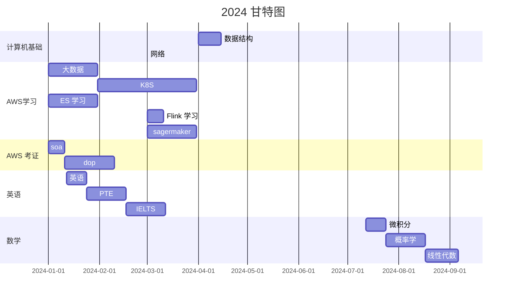

```mermaid

gantt
    title 2024 甘特图
    dateFormat YYYY-MM-DD
    section 计算机基础
    		数据结构: 2024-04-01, 14d
    		网络: 2024-03-01, 30dß
    section AWS学习
        大数据  :a1, 2024-01-01, 30d
        K8S   :after a1, 60d
        ES 学习:  2024-01-01, 30d
        Flink 学习:  2024-03-01, 10d
        sagermaker: 2024-03-01, 30d
    section AWS 考证
    		soa: aws1, 2024-01-01, 10d
    		dop: aws2, after aws1, 30d
    section 英语
        英语 :e1, 2024-01-12, 12d
        PTE    :e2,after e1, 24d
        IELTS: :e3,after e2, 24d
    section 数学
        微积分: m1, 2024-07-12, 12d
        概率学: m2,after m1,24d
        线性代数: m3,after m2, 20d
```

